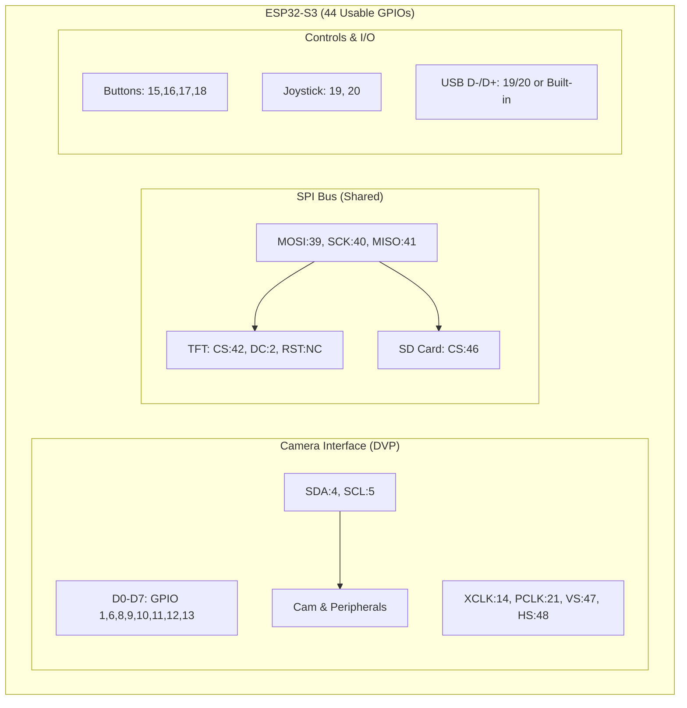
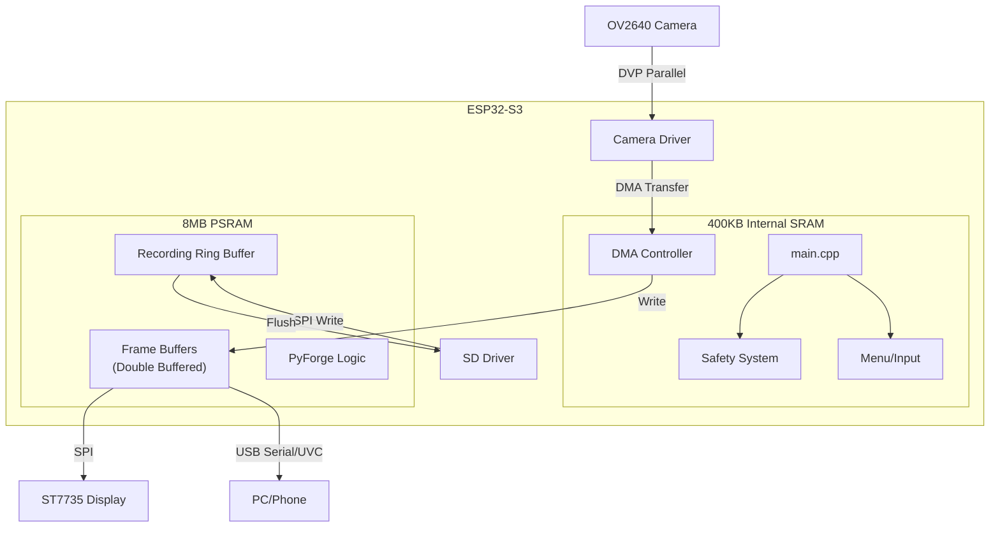
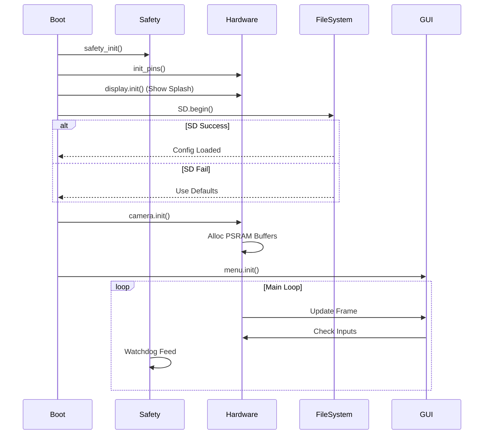
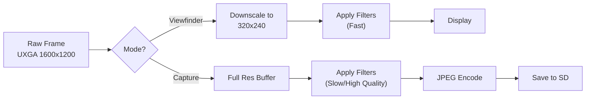
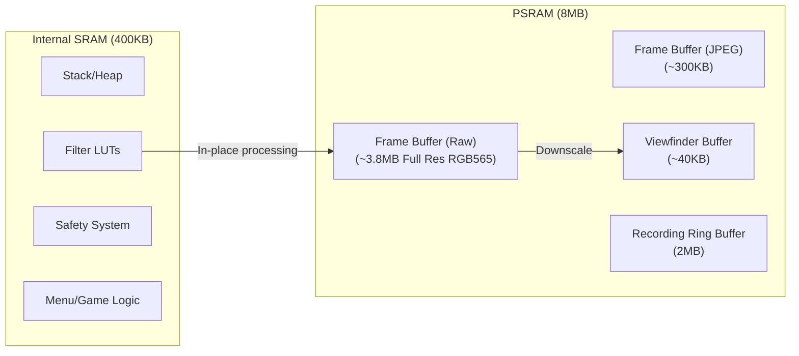
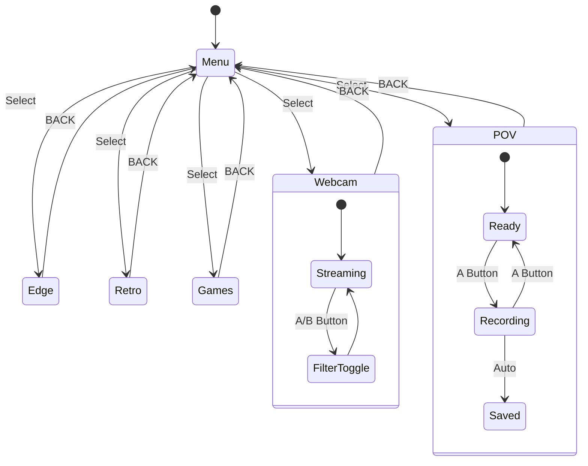
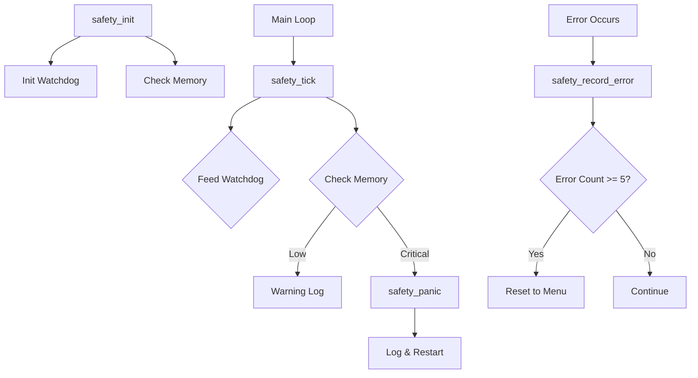
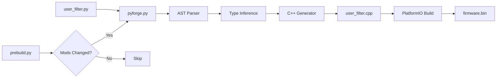

# 🏗️ OpenCamX OS Architecture

> Complete system design with memory layout, data flow, and component interactions.
> 
> **Critical Fixes Applied:** GPIO conflict resolution, USB role correction, DMA memory management, SD card boot logic, and performance-optimized filter pipeline.

---

## Summary of Critical Fixes

| Issue | Problem | Resolution |
|-------|---------|------------|
| **GPIO Conflict** | GPIOs 4-18 assigned to Camera, but 5, 12-18 also used by Display/SD | Redistributed pins to separate interfaces |
| **USB Role** | Incorrectly labeled as USB Host | Corrected to USB Device (UVC Gadget) |
| **Memory Management** | Missing DMA visualization | Added DMA controller for camera→PSRAM transfers |
| **Boot Logic** | Missing SD initialization | Added SD.init() before menu loads |
| **Filter Pipeline** | No downsampling for viewfinder | Added resolution-based processing paths |

---

## 1. Corrected GPIO Map (Hardware Layer)

> **Rationale:** Separated Parallel Camera interface, SPI Bus (shared by Display & SD), and Control pins. Avoided Strapping Pins (0, 45, 46) and Octal PSRAM pins (35, 36, 37) for boot stability.

### GPIO Assignment Table

| Interface | Pin Assignment | Notes |
|-----------|----------------|-------|
| **Camera D0-D7** | GPIO 1, 6, 8, 9, 10, 11, 12, 13 | Parallel data bus |
| **Camera Control** | XCLK:14, PCLK:21, VSYNC:47, HSYNC:48 | Timing signals |
| **I2C (Shared)** | SDA:4, SCL:5 | Camera SCCB + peripherals |
| **SPI Bus** | MOSI:39, SCK:40, MISO:41 | Shared by Display & SD |
| **Display** | CS:42, DC:2, RST: Not Connected | ST7735 SPI interface |
| **SD Card** | CS:46 | Uses shared SPI bus |
| **Buttons** | GPIO 15, 16, 17, 18 | A/B/X/Y buttons |
| **Joystick** | GPIO 19, 20 | Analog X/Y axes |

---

## 2. Corrected System Overview

> **Rationale:** Changed "USB Host" to "USB Device/UVC Gadget". Added DMA controller visualization for efficient camera data transfer.

### Key Architecture Notes

- **USB Role:** ESP32-S3 acts as a **USB Device (UVC Gadget)** to stream video to PC, NOT a USB Host
- **DMA:** Essential for moving camera data to PSRAM without freezing the CPU
- **Double Buffering:** Prevents tearing by alternating between two frame buffers

---

## 3. Corrected Boot Sequence

> **Rationale:** Added SD Card initialization. If SD fails, system boots but disables recording features.

---

## 4. Corrected Filter Pipeline (Performance Logic)

> **Rationale:** Added "Downsampling" step. Processing full-res (1600x1200) filters on ESP32 results in <2 FPS. Viewfinder uses lower res (320x240) for speed, while capture uses full res.

### Performance Considerations

| Mode | Resolution | Filter Speed | Target FPS |
|------|------------|--------------|------------|
| Viewfinder | 320x240 | Fast (integer math) | 15-30 FPS |
| Photo Capture | 1600x1200 (UXGA) | High Quality | N/A (single shot) |
| Video Recording | 640x480 (VGA) | Balanced | 15 FPS |

---

## 5. Memory Architecture (Revised)

> **Rationale:** Clarified buffer sizes. "1.5MB" is only accurate for raw frames. Display buffers are much smaller.

### Data Types & Memory Allocation

| Component | Struct/Type | Location | Size Est. |
|-----------|-------------|----------|-----------|
| Cam Buffer (Raw) | `uint8_t* fb` | PSRAM | ~3.8 MB (Full Res RGB565) |
| Cam Buffer (JPEG) | `camera_fb_t` | PSRAM | ~300 KB |
| Viewfinder | `uint16_t[128*160]` | SRAM/PSRAM | ~40 KB |
| Filter LUTs | `uint8_t[256]` | SRAM | 256 Bytes |
| Recording Buffer | `RingBuffer` | PSRAM | 2 MB |

---

## 6. Camera Mode Flow

---

## 7. Safety System

---

## 8. Corrected Error Handling

> **Rationale:** Added specific handling for "Camera Not Detected" - the most common ESP32-Cam error.

| Error Event | Handler | Action |
|-------------|---------|--------|
| **Cam Init Fail** | `setup()` | Show "No Camera" Icon on LCD, Disable Capture |
| **SD No Mount** | `setup()` | Show "No SD" Icon, Disable Recording |
| **Brownout** | `RTC_WDT` | Hardware issue: Flash LED SOS pattern, Sleep |
| **Heap Low** | `safety_tick` | Purge PyForge Mods, Release cached images |
| **Watchdog** | `ESP_WDT` | Reboot System |

---

## 9. PyForge Transpilation

---

## Key Technical Recommendations

### 1. PyForge Implementation
> **Don't write a full AST parser on the ESP32.** Instead:
> - Use MicroPython embedded (if resources allow), OR
> - Write a simple interpreter that maps specific OpCodes (e.g., `OP_SEPIA`, `OP_INVERT`) to C++ functions
> - A full Python-to-C++ transpiler on-chip is too heavy

### 2. Power Management
> The OV2640 draws significant current. **Add a 100μF+ capacitor** across the 3.3V and GND rails near the camera, or you will get "Brownout Detected" resets.

### 3. Frame Rate Optimization
> **Do NOT update the ST7735 (SPI) at camera resolution.**
> 
> Pipeline: Read Camera → Downscale → Write Display
> 
> This prevents bottlenecks and maintains smooth frame rates.

---

## Pin Conflict Avoidance Reference

| Pin Category | GPIOs to Avoid | Reason |
|--------------|----------------|--------|
| **Strapping Pins** | 0, 45, 46 | Boot mode selection |
| **Octal PSRAM** | 35, 36, 37 | Reserved for PSRAM interface |
| **USB Native** | 19, 20 | Reserved if using native USB |
| **JTAG** | 39, 40, 41, 42 | Debug interface (can be reused) |
